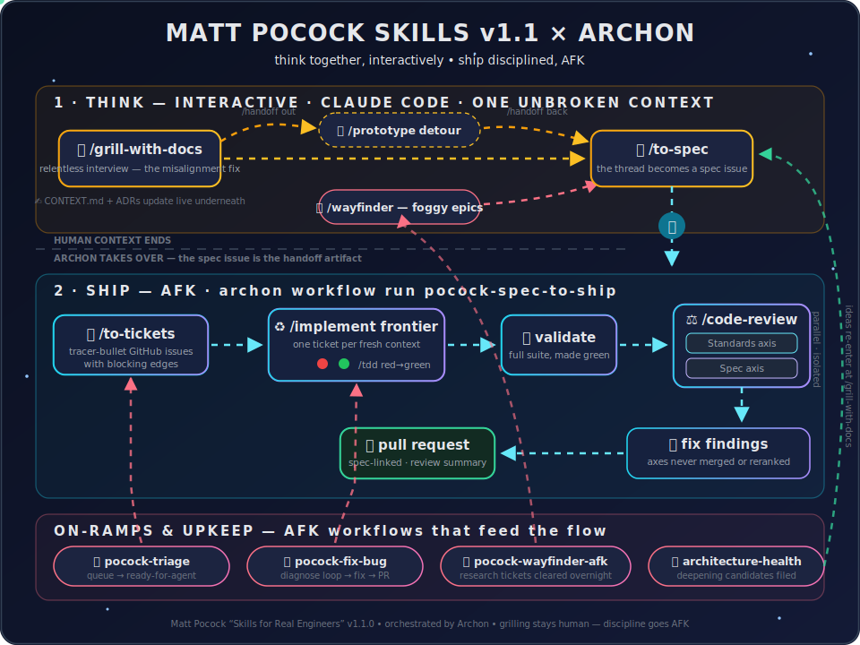

<p align="center">
  
</p>

<h1 align="center">archon-pocock-workflow</h1>

<p align="center">
  Matt Pocock's <a href="https://github.com/mattpocock/skills">"Skills For Real Engineers"</a> (<b>v1.1.0</b>) as an <a href="https://github.com/coleam00/Archon">Archon</a> workflow family:<br/>
  <i>the interactive thinking stays human — the disciplined execution goes AFK.</i>
</p>

<p align="center">
  
</p>

See [DESIGN.md](./DESIGN.md) for the full rationale and mapping.

## What's in the box

```
.archon/workflows/   six workflows: pocock-init, pocock-spec-to-ship,
                     pocock-triage, pocock-fix-bug, pocock-wayfinder-afk,
                     pocock-architecture-health
.archon/commands/    ten pocock-* command files (the orchestration prompts)
.claude/skills/      18 skill dirs copied from upstream mattpocock/skills @ v1.1.0
vendor/              the upstream clone, checked out at the v1.1.0 tag
install.ps1          copy the pack into a target repo
```

## Install into a repo

```powershell
./install.ps1 -TargetRepo C:\path\to\your\repo
```

Then, in the target repo:

```bash
archon workflow run pocock-init --no-worktree ""
```

`pocock-init` needs a GitHub remote and an authenticated `gh` CLI. It scaffolds `docs/agents/{issue-tracker,triage-labels,domain}.md`, a `CONTEXT.md` stub, `docs/adr/`, the triage labels, and the `## Agent skills` block — recording every defaulted decision for you to revise.

## Daily flow

**1. Think (interactive, in Claude Code — one unbroken context window):**

```
/grill-with-docs      sharpen the idea; CONTEXT.md and ADRs update as you go
/prototype            (optional detour via /handoff when a question needs runnable code)
/to-spec              publish the thread as a spec issue on GitHub
```

**2. Ship (AFK, in Archon):**

```bash
archon workflow run pocock-spec-to-ship --branch feat/my-feature "#123"
```

Tickets with blocking edges → frontier worked one-ticket-per-fresh-context with TDD → full validation → two-axis review (Standards | Spec) → findings fixed → PR.

**On-ramps:**

```bash
archon workflow run pocock-triage --no-worktree ""                      # work the issue queue (conservative: never closes)
archon workflow run pocock-fix-bug --branch fix/issue-42 "#42"          # diagnosing-bugs discipline, end to end
archon workflow run pocock-wayfinder-afk --no-worktree "#7"             # clear a wayfinder map's research tickets overnight
archon workflow run pocock-architecture-health --no-worktree ""         # survey deepening opportunities, file candidates
```

`pocock-wayfinder-afk` works only the map's AFK frontier — `wayfinder:research` tickets and agent-driveable `wayfinder:task` tickets. Grilling and prototype tickets are HITL by the skill's own rules ("the agent never stands in for the human's side of it"), so it leaves those for your next interactive `/wayfinder` session and briefs you on what's waiting.

Architecture candidates and triaged `ready-for-agent` issues feed back into step 1 or straight into the workflows — that's the whole `ask-matt` map, closed.

## Notes

- Set a strong model for Claude in `~/.archon/config.yaml` (`assistants.claude.model`) — implement/diagnose loops should not run on haiku.
- Update the skills: clone `mattpocock/skills` to `vendor/Matt_Pocock_Skills` (gitignored), check out the new tag, re-copy the 18 skill dirs into `.claude/skills/`, then `archon validate workflows`. The shipped snapshot in `.claude/skills/` is pinned at **v1.1.0** (MIT, see [LICENSE](./LICENSE)).
- Validate after any edit: `archon validate workflows && archon validate commands`.
